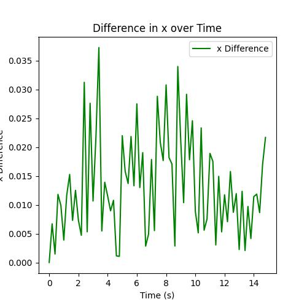
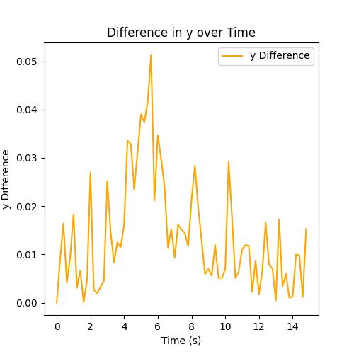
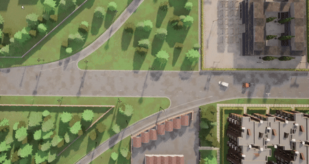

# Master_Thesis
This the repo for master_thesis
## 2024/01/24 QunZhang
Create the repo and add some related folder   
TODO List: 
```
1. Finish the one degree vehicle kinematic model
2. Linerize the model and try apply kf for it
3. Try ACC for the car model
```
## 2024/01/26 QunZhang
Add kalman filter and test it in CARLA simulation, and tighten the constraint as shown below: 
<p float="left">
  
  
   
</p>    
<!-- <p float="left">
   
  
</p>   
<p float="left"> -->
  
</p>   

TODO List: 
```
1. Finish the one degree vehicle kinematic model, done
2. Linerize the model and try apply kf for it, done
3. Try ACC for the car model   
   ACC_PID DONE
   MPC_PID Done
```
This is the result of IDM_PID:
<p float="left">
   
</p>   
This is the result of the MPC_PID_ACC:
<p float="left">
   
</p>   

## 2024/02/09 QunZhang
TODO List: 
```
1. Use chance MPC to tighen the velocity diff
2. Add the kf into the simulation
3. Try lane changing
```