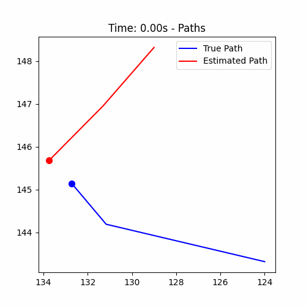
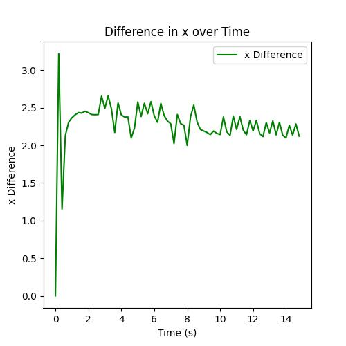
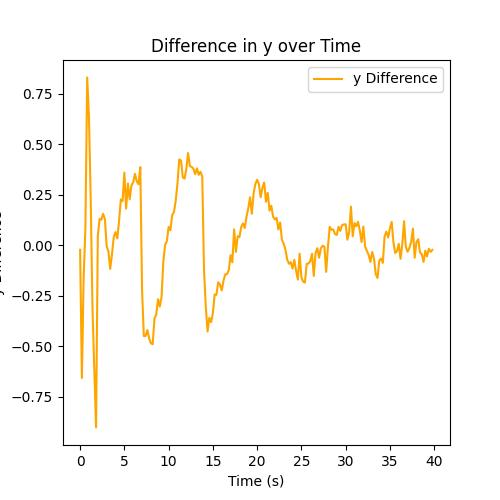

# Master_Thesis
This the repo for master_thesis
## 2024/01/24 QunZhang
Create the repo and add some related folder   
TODO List: 
```
1. Finish the one degree vehicle kinematic model
2. Linerize the model and try apply kf for it
3. Try ACC for the car model
```
## 2024/01/26 QunZhang
Add kalman filter and test it in CARLA simulation, as shown below: 
<p float="left">
  
  
</p>    
<p float="left">
   
  
</p>   

TODO List: 
```
1. Finish the one degree vehicle kinematic model, done
2. Linerize the model and try apply kf for it, done
3. Try ACC for the car model
```
