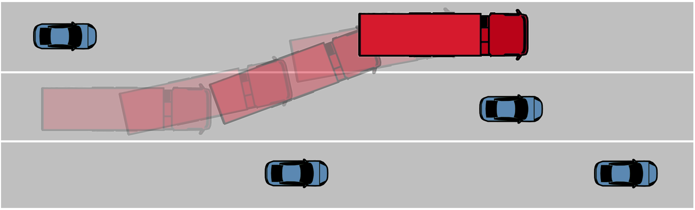
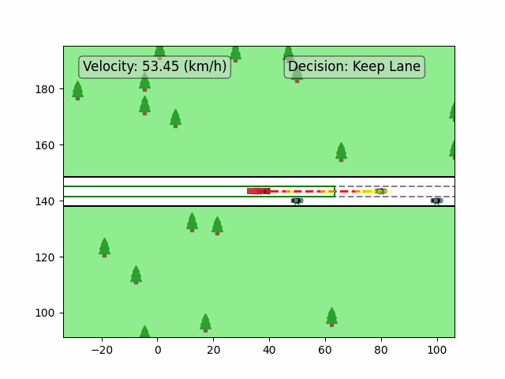

# MSc Thesis: Robust MPC for Autonomous Vehicles in Uncertain Situations

**Authors:** Qun Zhang, Saeed Salih, Erik Börve   
**Emails:** [qunz@chalmers.se](mailto:qunz@chalmers.se), [saeedsal@chalmers.se](mailto:saeedsal@chalmers.se), [borerik@chalmers.se](mailto:borerik@chalmers.se)  
**Affiliation:** Department of Electrical Engineering, Chalmers University of Technology, Göteborg, Sweden

## Purpose

The objectives of this thesis are to:

- Construct safety-critical scenarios for a heavy vehicle in the CARLA simulator, emphasizing realistic challenges in autonomous driving.
- Design and implement a Robust Model Predictive Controller (RMPC) that accounts for uncertainties in the ego-vehicle's state and dynamics, ensuring safety and reliability.
- Extend the RMPC to effectively handle uncertainties related to the surrounding vehicles, improving situational awareness and decision-making.

  

## Workflow

Our workflow integrates an Extended Kalman Filter (EKF) with a Model Predictive Controller (MPC) for enhanced accuracy and robustness, depicted in the figures below. Notably, we simulate sensor inputs rather than using actual CARLA sensors to streamline our process.

**Workflow Overview:**  

**Trajectory Propagation:**  
The difference between the simulated vehicle in CARLA and our nominal model is treated as noise. The figure illustrates how this discrepancy propagates over time.  

**Constraint Definitions:**  
For detailed constraint definitions, please refer to our supervisor's paper:  

  

*E. Börve, N. Murgovski, and L. Laine, "Interaction-Aware Trajectory Prediction and Planning in Dense Highway Traffic using Distributed Model Predictive Control."*

If you find the details on constraint definitions helpful or if they've sparked some ideas for your own work, we'd really appreciate it if you could cite our supervisor's paper.

**SMPC Constraint Tightening:**  
To address these issues, we employ Stochastic MPC (SMPC) techniques to tighten state constraints, especially for trailing and lane changing maneuvers.  

## Simulation in the CARLA Environment

We showcase our RMPC's performance in various driving scenarios within the CARLA simulator. Below are GIFs depicting different aspects of the driving scenario, including Adaptive Cruise Control (ACC) in heavy traffic, lane changing with MPC_PID control, decision-making processes.

**Adaptive Cruise Control in Heavy Traffic:**  

  

**MPC_PID Lane Changing:**  

  

**Decision Making Process:**  

  

**Driving in Heavy Traffic Conditions:**  

  

**Driving in Heavy Traffic Conditions using EKF:**  

  

**Controller Testing in CARLA:**  

  

**Vehicle Trajectory:**  
The trajectory followed by the vehicle during the tests.

  

