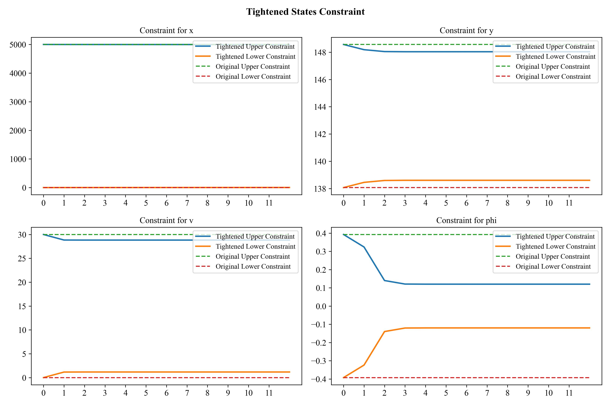
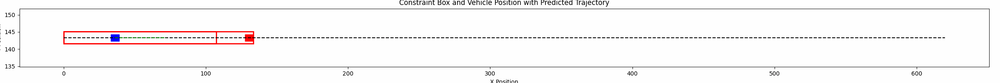
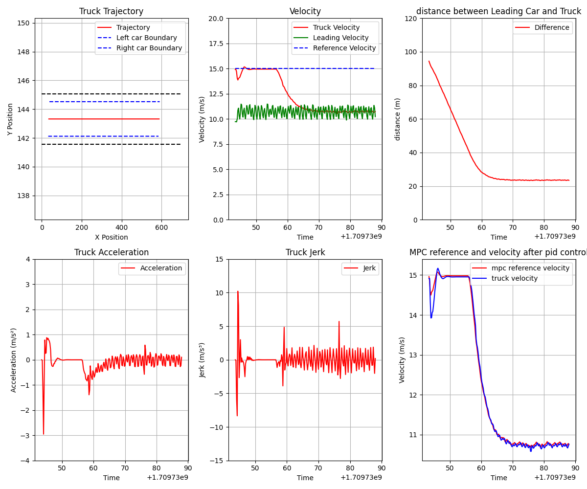
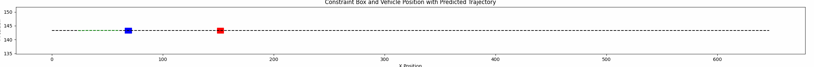
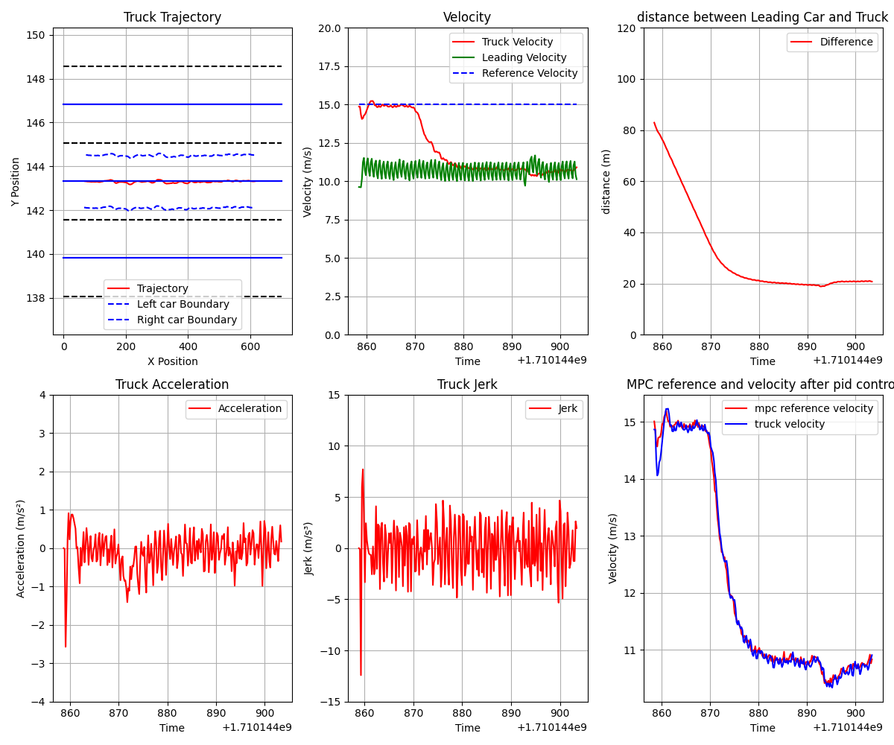
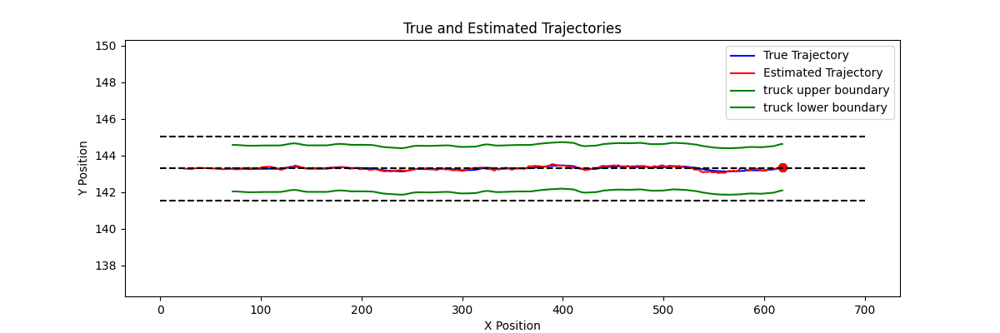
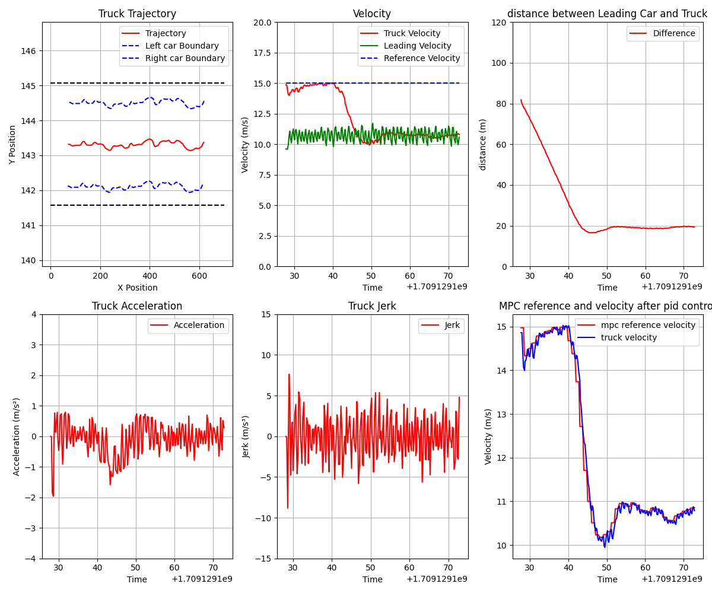
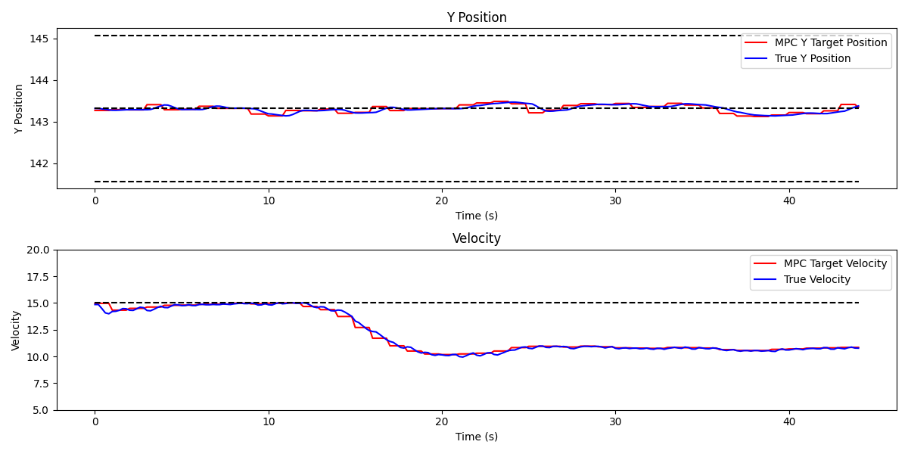
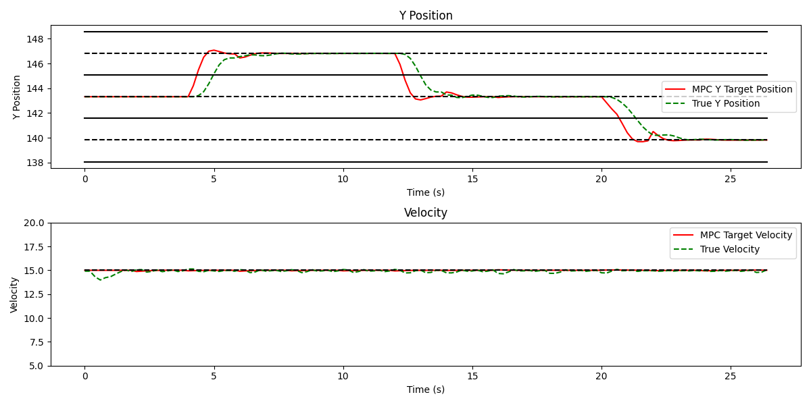
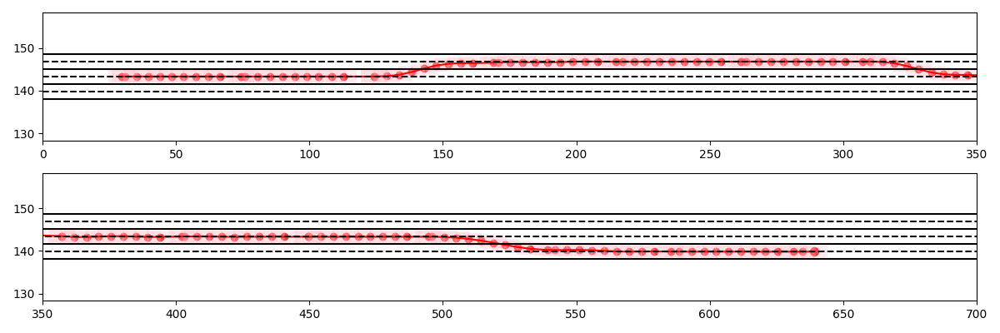

# Master_Thesis
## This the repo for master_thesis
For the EKF_MPC, we use the workflow shown below (we did not use the sensor in carla actually):
<p float="left">
   
</p>   
<p float="left">
   
</p>   
<p float="left">
   
</p>   
<p float="left">
   
</p>   

## 2024/01/24 QunZhang
Create the repo and add some related folder   

## 2024/01/26 QunZhang
Add kalman filter and test it in CARLA simulation, and tighten the constraint as shown below: 
<p float="left">
  
  
   
</p>    


## 2024/02/09 QunZhang
This is the result of the MPC_PID_ACC:
<p float="left">
   
</p>   
This is the result of the MPC_PID_ACC without kalman filter (red bounding box is tighten IDM_constraint):  
<p float="left">
   
</p>   
<p float="left">
   
</p>   

## 2024/02/14 QunZhang   

This is the result of the MPC_PID_ACC with kalman filter (red bounding box is tighten IDM_constraint):  
<p float="left">
   
</p>   
<p float="left">
   
</p>   
<p float="left">
   
</p>   
<p float="left">
   
</p>   
This is the result of the MPC_PID_ACC with kalman filter (PID works every 0.2s, MPC works every 1s):
(Computional time of the MPC is:  0.067s with N=12, 0.11s with N=30)
<p float="left">
   
</p>   
</p>   
<p float="left">
   
</p>   
<p float="left">
   
</p>   
<p float="left">
   
</p>   
<p float="left">
   
</p>   

## 2024/03/07 QunZhang
Here is the right lane changing constraint:   
<p float="left">
   
</p>   

Here is the right lane change result:  
<p float="left">
   
</p>   
<!-- <p float="left">
   
</p>    -->

## 2024/03/19 QunZhang
Here is the decision master result:
<p float="left">
   
</p>   
<p float="left">
   
</p>   
## 2024/03/19 QunZhang
TODO List: 
```
1. tunning the controller
3. decision master
```